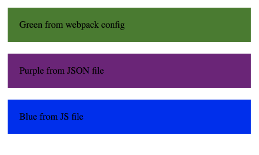

# sass-vars-loader usage example

This is a simple example project using webpack2 and sass-vars-loader.

The Sass vars in `src/styles.scss` are read from `webpack.config.js`, `config/sassVars.js`
and `config/sassVars.json`.

Open those files and play around! :)


## Installing

```
yarn install
```

## Running

First build the `bundle.js`
```
yarn build
```

and then open `index.html` in your browser.


It should look like this:

